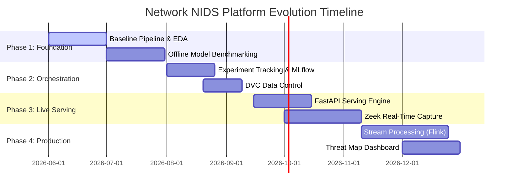

# Multi-Phase Development & Scaling Roadmap: Network Threat Analytics Platform

This document outlines the strategic roadmaps for evolving the current baseline implementation into a production-grade, highly available, and auto-scaling Network Intrusion Detection (NIDS) and threat analytics platform.

---

## 1. Multi-Phase Roadmap Overview



### Phase 1: Core Foundation & Offline Benchmarking (Current)
*   **Focus**: Standardize project structures, design preprocessing transformation pipelines, and evaluate baseline XGBoost classifiers.
*   **Deliverables**: Modular training code (`src/`), data validation configurations, descriptive dataset reports, and automated unit testing suites.

### Phase 2: Experiment Tracking & Data Control
*   **Focus**: Prevent training drift, track validation statistics across model runs, and version training datasets.
*   **Deliverables**:
    *   **MLflow Integration**: Instrument `src/models/train.py` to auto-log hyper-parameters, training metrics (Recall, macro-F1), and confusion matrices.
    *   **Data Version Control (DVC)**: Implement DVC to track data file hashes in `data/raw` and `data/processed`, storing the raw datasets in an external enterprise object store (S3/GCS) rather than Git.

### Phase 3: Real-Time Serving API & Packet Monitoring
*   **Focus**: Deploy the trained model behind a highly available API gateway and set up log-based ingestion from active networks.
*   **Deliverables**:
    *   **FastAPI Ingestion Gateway**: Construct a microservice that exposes a `/predict` endpoint, accepting connection records as JSON objects and outputting alert decisions with confidence probabilities.
    *   **Zeek Logger Integration**: Deploy a **Zeek Network Security Monitor** on a network SPAN port. Configure Zeek's `conn.log` to stream session records directly to the API endpoint for evaluation.

### Phase 4: Scale-Out Streaming & Threat Analytics Dashboard
*   **Focus**: Scale the platform to process high-speed networks and visualize threat alerts in real time.
*   **Deliverables**:
    *   **Stream Processing (Flink/Kafka)**: Connect Zeek logs to a **Kafka** message broker. Use **Apache Flink** to compute sliding window statistics (SYN error rates, host connection counts) in real time over incoming packet metadata.
    *   **Analytics Threat Map**: Create an interactive dashboard (e.g., Streamlit or React) to display live threat alerts, visualize compromised host maps, and show classifier performance metrics.

---

## 2. Platform Scaling & Architectural Evolution

As the system moves from training offline models on NSL-KDD to processing live enterprise traffic, the directory structure is designed to scale modularly without requiring code rewrites.

```text
network-intrusion-detection/
├── src/
│   ├── api/                  # [NEW] Phase 3: Real-time serving
│   │   ├── __init__.py
│   │   ├── main.py           # FastAPI application definition
│   │   └── schemas.py        # Pydantic verification schemas
│   │
│   ├── streaming/            # [NEW] Phase 4: High-speed ingestion
│   │   ├── __init__.py
│   │   ├── kafka_producer.py # Network log publisher
│   │   └── flink_window.py   # Stream aggregation logic
│   │
│   └── dashboard/            # [NEW] Phase 4: User Interface
│       ├── __init__.py
│       └── app.py            # Streamlit dashboard
```

### A. Integrating Experiment Tracking (MLflow)
The existing folder structure contains a `configs/` directory. To add experiment tracking, we update `model_config.yaml` to include an `mlflow:` parameters block, and update `train.py` as follows:

```python
import mlflow
import mlflow.xgboost

def train():
    mlflow.set_tracking_uri(os.getenv("MLFLOW_TRACKING_URI", "http://localhost:5000"))
    with mlflow.start_run():
        # Log parameters
        mlflow.log_params(xgb_params)
        
        # Train model
        model.fit(X_train, y_train)
        
        # Log metrics
        mlflow.log_metric("accuracy", acc)
        mlflow.log_metric("f1_macro", f1)
        
        # Log model artifact
        mlflow.xgboost.log_model(model, "model")
```

### B. Scalable API Serving Layer (FastAPI)
The modular preprocessing ColumnTransformer (`preprocessing_pipeline.joblib`) created during Phase 1 can be loaded directly inside the FastAPI app to transform incoming connection payloads in real time before passing them to the XGBoost inference model:

```python
from fastapi import FastAPI
import joblib
import pandas as pd
from pydantic import BaseModel

app = FastAPI(title="Real-Time Intrusion Detection Engine")

# Load pre-trained pipeline and model
preprocessor = joblib.load("models/preprocessing_pipeline.joblib")
model = joblib.load("models/network_intrusion_xgb.joblib")

class ConnectionRecord(BaseModel):
    duration: int
    protocol_type: str
    service: str
    flag: str
    src_bytes: int
    dst_bytes: int
    # ... other standard NSL-KDD features ...

@app.post("/predict")
def predict_intrusion(record: ConnectionRecord):
    # Convert Pydantic record to pandas DataFrame
    df_in = pd.DataFrame([record.dict()])
    
    # Apply preprocessor and perform inference
    X_proc = preprocessor.transform(df_in)
    prediction = model.predict(X_proc)[0]
    probability = model.predict_proba(X_proc)[0]
    
    return {
        "intrusion_detected": bool(prediction),
        "confidence": float(probability[prediction])
    }
```

### C. Live Threat Dashboard (Streamlit)
To visualize alerts, a lightweight Streamlit app can be added in `src/dashboard/app.py`. The dashboard will query the SIEM database or read directly from the alert database to display:
- Live threats grouped by severity (DoS, Probe, U2R, R2L).
- Metrics charts (e.g., sliding window of packet volumes vs. alert counts).
- Controls to trigger automated model retraining or fetch the latest models from the MLflow Model Registry.
