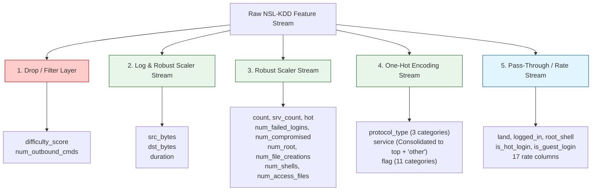
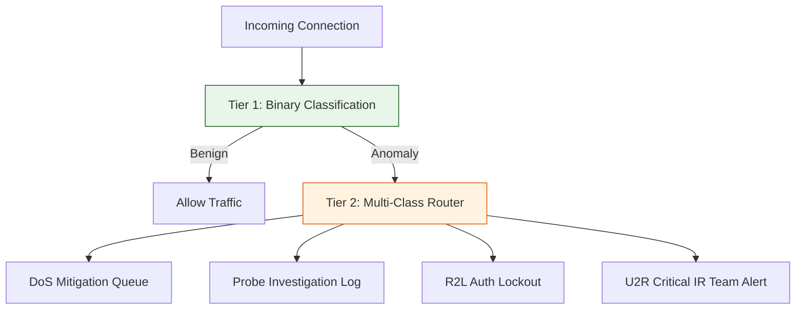

# Preprocessing Blueprint & Dataset Decisions

This document serves as the **Preprocessing Blueprint and Data Decision Record** for the Network Intrusion Detection and Threat Analytics Platform. It outlines the columns to keep, drop, encode, and scale, details target classification formulations, and establishes the data splitting strategy. It provides a production-grade specification to guide the pipeline implementation in Phase 2.

---

## 1. Feature Preprocessing & Transformation Blueprint

The diagram below illustrates the exact path each raw variable takes through the pre-processing ColumnTransformer:



---

## 2. Dataset Column Decisions

### A. Keep (39 Features)
These features provide high information entropy or serve as critical telemetry flags. They are grouped below by their extraction category:

1.  **Basic Features (6)**: `duration`, `src_bytes`, `dst_bytes`, `land`, `wrong_fragment`, `urgent`.
2.  **Content Features (11)**: `hot`, `num_failed_logins`, `logged_in`, `num_compromised`, `root_shell`, `su_attempted`, `num_root`, `num_file_creations`, `num_shells`, `num_access_files`, `is_hot_login`, `is_guest_login`.
3.  **Time-Based Traffic Features (9)**: `count`, `srv_count`, `serror_rate`, `srv_serror_rate`, `rerror_rate`, `srv_rerror_rate`, `same_srv_rate`, `diff_srv_rate`, `srv_diff_host_rate`.
4.  **Host-Based Traffic Features (13)**: `dst_host_count`, `dst_host_srv_count`, `dst_host_same_srv_rate`, `dst_host_diff_srv_rate`, `dst_host_same_src_port_rate`, `dst_host_srv_diff_host_rate`, `dst_host_serror_rate`, `dst_host_srv_serror_rate`, `dst_host_rerror_rate`, `dst_host_srv_rerror_rate`, plus structural rate features.

---

### B. Drop (2 Features)
These columns are dropped during ingestion to optimize pipeline performance and prevent data leakage:

| Feature Name | Category | Primary Rationale for Removal | MLOps Impact |
|--------------|----------|--------------------------------|--------------|
| `difficulty_score` | Auxiliary | **Potential Data Leakage**: Generated post-hoc by researchers based on classifier errors. It contains direct predictions, which are unavailable during live deployment. | If kept, model metrics will look inflated but the model will fail in production. |
| `num_outbound_cmds`| Content | **Zero Variance**: This feature is always `0` across all train and test records. It provides no information. | Keeping it wastes memory and increases computing overhead. |

---

### C. Encode (3 Features)
Categorical columns must be transformed into numeric representations. We use different strategies depending on cardinality:

1.  **`protocol_type` (One-Hot Encoding)**:
    -   *Cardinality*: 3 unique values (`tcp`, `udp`, `icmp`).
    -   *Strategy*: Expand into 3 binary columns.
    -   *Rationale*: Low cardinality, no risk of feature space explosion.
2.  **`flag` (One-Hot Encoding)**:
    -   *Cardinality*: 11 unique values (`SF`, `S0`, `REJ`, `RSTR`, `SH`, `RSTO`, `S1`, `RSTOS0`, `S3`, `S2`, `OTH`).
    -   *Strategy*: Expand into 11 binary columns.
    -   *Rationale*: Low cardinality. These flags indicate TCP state machine status, which is highly predictive of DoS/Probe attacks.
3.  **`service` (One-Hot Encoding with Frequency Thresholding)**:
    -   *Cardinality*: $>70$ unique values (e.g., `http`, `smtp`, `private`, etc.).
    -   *Strategy*: Keep the top 15 most frequent services. Group all other services into an `'other'` category, then apply One-Hot Encoding.
    -   *Rationale*: Prevents the "curse of dimensionality" and limits feature space expansion to a manageable size.

---

## 3. Target Modeling Strategy

To build a production-ready system, we implement a **two-tiered modeling strategy** rather than relying on a single classifier:



### Strategy A: Binary Intrusion Detection (Tier 1)
*   **Objective**: High-speed filtering. Classify connection attempts as **Normal (0)** or **Anomaly (1)**.
*   **Production Goal**: Extremely fast inference (latency $< 10\text{ms}$). Optimized to prioritize **Recall** (minimizing false negatives) to ensure no attacks bypass the filter, while maintaining a low false positive rate to prevent analyst alert fatigue.
*   **Model Objective**: Binary logloss, outputting probability scores $p \in [0.0, 1.0]$.

### Strategy B: Multi-Class Threat Router (Tier 2)
*   **Objective**: Threat classification. If the Tier 1 model flags an anomaly, route it to the Tier 2 model to determine the attack family:
    1.  **DoS**: Triggers traffic rate limiting or IP blocking.
    2.  **Probe**: Logs scanning activity and flags IPs for threat investigation.
    3.  **R2L**: Blocks brute-force login attempts and forces credentials resets.
    4.  **U2R**: Triggers immediate, high-priority incident response (IR) alerts.
*   **Model Objective**: Multi-class softmax (`multi:softprob`), outputting probabilities across all 5 classes (Normal, DoS, Probe, R2L, U2R).

---

## 4. Multi-Phase Splitting Strategy

To ensure model evaluations reflect real-world performance, we use a structured splitting strategy that mimics network concept drift and zero-day vulnerabilities:

```text
Full Ingested NSL-KDD
├── KDDTrain+ (125,973 connections)
│   ├── Training Split (80% / 100,778 samples) -> Pipeline Fitting & Hyperparameter Tuning
│   └── Validation Holdout (20% / 25,195 samples) -> Local pipeline evaluation & metrics checks
│
└── KDDTest+ (22,544 connections) -> Final Out-of-Distribution Drift Test
    └── Contains 17 attack classes never seen during training (simulating zero-days)
```

1.  **Stratified Split**: The `KDDTrain+` dataset is split into training ($80\%$) and validation ($20\%$) subsets. The split is stratified by attack category to ensure rare classes like U2R are represented proportionally in both sets.
2.  **Out-of-Distribution Drift Test (`KDDTest+`)**: The training pipeline does not see the test set. Because the test set contains 17 novel attack classes, it serves as an excellent benchmark for measuring how well our models generalize to zero-day vulnerabilities.
