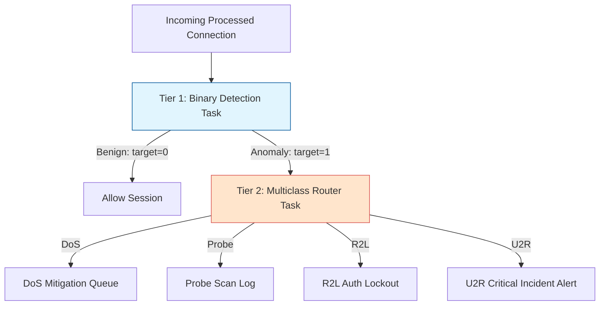

# Model Training Design Document: Phase 3

This document outlines the **Modeling Strategy, Metrics Hierarchy, and Training Architecture** for Phase 3 of the Network Intrusion Detection and Threat Analytics Platform. It serves as a technical specification and engineering blueprint to guide the development of baseline classifiers, reusable evaluation engines, and automated leaderboards.

---

## 1. Modeling Strategy & Target Tasks

The platform implements a **two-tiered security classification architecture** that balances latency and categorization depth:



### A. Binary Detection Task (Tier 1 Filter)
*   **Target Formulation**: `Benign (0)` vs. `Anomaly (1)`.
*   **Performance Goal**: **Maximize Recall** (minimizing False Negatives).
*   **Engineering Rationale**: In cybersecurity, the cost of missing an active intrusion attempt (a False Negative) is infinitely higher than the operational overhead of investigating a false alarm (a False Positive). The model must act as a highly sensitive filter that catches all potential threats.
*   **Optimization Parameter**: Primary focus on maximizing **Recall** for the Anomaly class.

### B. Multiclass Classification Task (Tier 2 Router)
*   **Target Formulation**: 5 distinct classes mapping threat categories:
    1.  `normal` (Legitimate network sessions)
    2.  `dos` (Denial of Service resource exhaustion attacks)
    3.  `probe` (Network scanning and surveillance sweeps)
    4.  `r2l` (Unauthorized remote access exploits)
    5.  `u2r` (Unauthorized local root privilege escalations)
*   **Performance Goal**: **Correct Threat Categorization**.
*   **Engineering Rationale**: Once a threat is detected by Tier 1, it must be accurately routed to the correct defense pipeline. Misclassifying a critical U2R attack as a basic DoS would trigger simple rate limiting instead of immediate host quarantine, leaving administrative privileges compromised.
*   **Optimization Parameter**: Primary focus on class-specific **F1-Score** and **Recall** per threat group (particularly for rare U2R and R2L classes).

---

## 2. Modeling Development Roadmap

To ensure a disciplined, scientific model building process, we implement a phased roadmap. We start by training trusted baseline classifiers before introducing complex ensembles:

```text
Baseline Models (Current Phase)   Intermediate Models               Advanced Models
┌─────────────────────────────┐   ┌─────────────────────────────┐   ┌─────────────────────────────┐
│ 1. Logistic Regression      │   │ 5. Support Vector Machine   │   │ 8. Gradient Boosting Trees  │
│ 2. Decision Tree            │ ─>│ 6. Random Forest            │ ─>│ 9. XGBoost                  │
│ 3. K-Nearest Neighbors (KNN)│   │ 7. Extra Trees              │   │ 10. Voting / Stacking       │
│ 4. Gaussian Naive Bayes     │   │                             │   │                             │
└─────────────────────────────┘   └─────────────────────────────┘   └─────────────────────────────┘
```

### Baseline Classifiers (Current Milestone)
1.  **Logistic Regression**: Uses standard L2 regularization. Provides a highly interpretable, fast linear baseline.
2.  **Decision Tree**: Gini impurity splitting with a limited maximum depth to prevent overfitting on static connection metrics.
3.  **K-Nearest Neighbors (KNN)**: Distance-weighted clustering ($K=5$) to evaluate spatial threat clustering.
4.  **Gaussian Naive Bayes (GNB)**: High-speed probabilistic classifier assuming feature independence.
5.  **Support Vector Classifier (SVC)**: Radial Basis Function (RBF) kernel with regularized cost parameter ($C=1.0$).

*Why no ensembles yet?* Starting directly with XGBoost or Random Forests makes it impossible to understand if complex models are actually improving performance. Building baseline classifiers first provides a clear benchmark to measure future progress.

---

## 3. Metrics Evaluation Hierarchy

For cybersecurity deployments, model evaluations must be structured around risk priority rather than global metrics:

$$\text{Recall} \longrightarrow \text{F1-Score} \longrightarrow \text{ROC-AUC} \longrightarrow \text{Accuracy}$$

### 1. Recall (Priority 1)
- **Calculation**: 
  $$\text{Recall} = \frac{\text{True Positives}}{\text{True Positives} + \text{False Negatives}}$$
- **Significance**: The percentage of actual attacks successfully detected. A high recall guarantees that very few intrusions slip past the system unnoticed.

### 2. F1-Score (Priority 2)
- **Calculation**: 
  $$\text{F1} = 2 \times \frac{\text{Precision} \times \text{Recall}}{\text{Precision} + \text{Recall}}$$
- **Significance**: The harmonic mean of Precision and Recall. Evaluates how well the model balances false alarms (Precision) and missed attacks (Recall).

### 3. ROC-AUC (Priority 3)
- **Significance**: Measures the model's ability to distinguish between benign and malicious traffic across all probability thresholds. Highly useful for tuning the classification threshold.

### 4. Accuracy (Priority 4)
- **Significance**: The percentage of correct predictions. **Do not optimize for accuracy.** Because U2R attacks represent only $0.04\%$ of the dataset, a model can achieve $99.96\%$ accuracy by completely ignoring U2R threats, leaving the network vulnerable.

---

## 4. Phase 3 Modular Architecture

We organize our modeling files under `src/models/` to support clean pipeline execution, experiment tracking, and automated model registering:

```text
src/models/
├── __init__.py
├── train.py          # Orchestrates training pipeline, fitting baseline models on processed Parquet files
├── evaluate.py       # Reusable evaluation suite (Precision, Recall, ROC-AUC, classification reports)
├── registry.py       # Handles saving, versioning, and loading joblib model binaries
├── metrics.py        # Custom metric calculators (computes micro/macro rates for multiclass)
├── tuning.py         # Skeletons for Phase 4 hyperparameter optimization runs
└── inference.py      # Serves as the loadable scoring utility for real-time APIs
```

---

## 5. Artifacts and Outputs Specifications

Executing the baseline training pipeline will automatically generate the following artifacts:

### A. Serialized Model Binaries (`models/`)
Fitted baseline model objects will be serialized as standard joblib binaries:
- `models/logistic_regression.joblib`
- `models/decision_tree.joblib`
- `models/knn.joblib`
- `models/naive_bayes.joblib`
- `models/svm.joblib`

### B. Analytical Reports (`reports/model_evaluation/`)
1.  **Model Comparison Leaderboard (`reports/model_evaluation/leaderboard.md`)**: A structured markdown report comparing models on Recall, F1, Accuracy, and ROC-AUC, highlighting the best performer for production deployment.
2.  **Comparison Matrix CSV (`reports/model_evaluation/model_comparison.csv`)**: A structured tabular dataset containing detailed metrics for subsequent visualization.
3.  **Confusion Matrices (`reports/model_evaluation/confusion_matrices/`)**: Folder containing visual matrices (PNG format) showing true vs. predicted labels for each model.
4.  **ROC Curves (`reports/model_evaluation/roc_curves/`)**: Folder containing ROC curves comparing model threshold tradeoffs.
