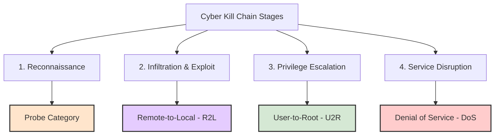

# Cybersecurity Threat Analysis Report: NSL-KDD Attack Classes

This report presents a deep, cybersecurity-focused analysis of the attack classes represented in the **NSL-KDD dataset**. Rather than treating labels as plain strings or numerical targets, this audit breaks down the exact network security mechanisms, operational objectives, protocol footprints, traffic anomalies, and feature triggers associated with every threat family.

---

## 1. Taxonomic Hierarchy & Threat Landscape

The NSL-KDD dataset categorizes malicious activities into four major security paradigms. Each represents a distinct stage in the cyber kill chain:

---

## 2. Denial of Service (DoS) attacks
**Core Objective**: Render system services, application interfaces, or complete network links unavailable to legitimate users by exhausting hardware resources (CPU, RAM, buffer space) or consuming all available transmission bandwidth.

### Specific Attack Profiles & Mechanisms

#### A. `neptune` (SYN Flood)
*   **Mechanism**: Exploits the standard TCP three-way handshake ($SYN \to SYN-ACK \to ACK$). The attacker transmits a stream of $SYN$ packets with spoofed, unreachable source IP addresses. The victim host responds with $SYN-ACK$ packets and allocates state memory in its TCP connection backlog queue (TCB), waiting for an $ACK$ response that never arrives.
*   **Network Impact**: The TCB queue is completely exhausted, preventing any new legitimate TCP connections from being accepted.
*   **Traffic Footprint**: Large volume of $SYN$ packets without corresponding $ACK$ handshakes; multiple half-open connections originating from a wide distribution of external IP addresses.
*   **Key Detection Features in NSL-KDD**:
    *   `serror_rate` $\approx 1.0$ (High ratio of connections with SYN errors).
    *   `srv_serror_rate` $\approx 1.0$ (Same-service SYN error rate).
    *   `dst_host_serror_rate` $\approx 1.0$ (Host-level SYN error rate).
    *   `flag` = `S0` (Connection attempt seen, no response).

#### B. `smurf` (ICMP Broadcast Flood)
*   **Mechanism**: The attacker transmits a high-volume stream of ICMP Echo Request ($Ping$) packets. The key indicator is that the source IP address of the ICMP packets is spoofed to match the IP of the *victim*, and the destination address is set to the IP broadcast address of an active network.
*   **Network Impact**: Every host on the broadcast network replies with an ICMP Echo Reply to the spoofed source (the victim), creating a massive amplification effect that saturates the victim's link.
*   **Traffic Footprint**: A sudden, enormous influx of ICMP Echo Reply packets with identical destination IP addresses.
*   **Key Detection Features in NSL-KDD**:
    *   `protocol_type` = `icmp`
    *   `src_bytes` is relatively small, but `count` (number of connections in the last 2 seconds) and `srv_count` spikes exponentially.
    *   `dst_bytes` spikes if incoming responses saturate the interface.

#### C. `back` (Apache HTTP Denial of Service)
*   **Mechanism**: An application-layer flood. The attacker sends a high frequency of standard HTTP GET requests to an Apache web server, but with a URL containing a huge chain of consecutive forward slashes (e.g., `GET /////////// HTTP/1.0`).
*   **Network Impact**: The web server expends significant CPU and memory resources attempting to parse and clean the malformed URL paths. The request processing threads are blocked, preventing the server from handling legitimate user requests.
*   **Traffic Footprint**: Repeated, high-frequency HTTP requests to port 80/443 with long, redundant slash patterns in the payload.
*   **Key Detection Features in NSL-KDD**:
    *   `service` = `http`
    *   `count` / `srv_count` show extreme spikes.
    *   `hot` feature may trigger due to anomalous patterns in payload signatures.

#### D. `teardrop` (IP Fragmentation Overlap)
*   **Mechanism**: Capitalizes on OS kernel vulnerabilities during the reassembly of fragmented IP packets. The attacker sends fragments of an IP packet with overlapping `offset` values in the IP headers.
*   **Network Impact**: When the victim kernel attempts to reassemble these malformed fragments, the allocation of memory offsets leads to integer underflows or system crashes (Blue Screen of Death / Kernel Panic).
*   **Traffic Footprint**: Highly fragmented packets with invalid or overlapping offset values.
*   **Key Detection Features in NSL-KDD**:
    *   `wrong_fragment` $> 0$ (Direct indication of malformed/invalid fragmentation).
    *   `protocol_type` = `udp` (typically targeted because UDP packets are easily fragmented without connection checks).

---

## 3. Probing (Probe) / Reconnaissance
**Core Objective**: Map out the network landscape, discover active hosts (IP scanning), determine which ports are open (port scanning), and fingerprint running operating systems and service versions.

### Specific Attack Profiles & Mechanisms

#### A. `satan` (Security Administrator Tool for Analyzing Networks)
*   **Mechanism**: Multi-vector automated vulnerability scanning. It systemically checks target hosts for open ports, old daemons, and common configuration weaknesses (such as anonymous writable FTP or unpatched services).
*   **Network Impact**: Increased noise on the network, minor consumption of server connection threads, but primarily exposes the system to subsequent targeted attacks.
*   **Traffic Footprint**: Rapid sequential connection requests on multiple ports across many hosts over a short period.
*   **Key Detection Features in NSL-KDD**:
    *   `dst_host_diff_srv_rate` $\approx 1.0$ (High variation in the services accessed on the destination).
    *   `rerror_rate` and `srv_rerror_rate` spike because the scanner hits many closed ports that reject (`REJ`) connections.

#### B. `nmap` (Network Mapper)
*   **Mechanism**: A scanning utility used to run stealth scans (e.g., $SYN$ scan, $FIN$ scan, Null scan). Instead of establishing a complete TCP connection, it sends custom-crafted packets to watch how the victim system responds.
*   **Network Impact**: Very low bandwidth utilization, designed to bypass simple stateful firewalls.
*   **Traffic Footprint**: Large quantities of half-open connections, out-of-order flags (e.g., $URG, PUSH, FIN$ set together in a "Xmas scan"), and high rates of connection rejections.
*   **Key Detection Features in NSL-KDD**:
    *   `dst_host_same_src_port_rate` $\approx 1.0$ (Scanning multiple systems from a single source port).
    *   `srv_diff_host_rate` is high.
    *   `flag` matches error codes like `RSTR` or `REJ`.

---

## 4. Remote-to-Local (R2L) / Infiltration
**Core Objective**: Gain unauthorized local user access to a machine from a remote position over the network. The attacker exploits application vulnerabilities or weak credentials to run local shell commands.

### Specific Attack Profiles & Mechanisms

#### A. `guess_passwd` (Brute-Force Password Guessing)
*   **Mechanism**: Systematic brute-force or dictionary-based guessing against interactive remote login protocols (such as SSH, Telnet, or FTP).
*   **Network Impact**: Floods auth logs, consumes authentication threads, and risks full user account takeover.
*   **Traffic Footprint**: Repeated connection attempts to authentication ports with very short durations and immediate closures.
*   **Key Detection Features in NSL-KDD**:
    *   `num_failed_logins` $> 0$ (Direct metric of bad attempts).
    *   `count` or `dst_host_srv_count` show structured patterns over the same service (e.g., SSH or FTP).
    *   `logged_in` = `0` (or shifts to `1` on a successful breach).

#### B. `ftp_write` (FTP Write Exploit)
*   **Mechanism**: Takes advantage of anonymous FTP servers that are misconfigured to allow write permissions to the root or execution directories. The attacker uploads malicious files (like `.rhosts` or web shells) to gain system access.
*   **Network Impact**: Compromises file integrity and establishes a backdoor for future access.
*   **Traffic Footprint**: FTP traffic containing commands like `STOR` (Store/Upload) directed at restricted target paths.
*   **Key Detection Features in NSL-KDD**:
    *   `service` = `ftp` or `ftp_data`.
    *   `is_guest_login` = `1` (accessing the service anonymously).
    *   `hot` indicator triggers (representing unauthorized file-writing actions).

---

## 5. User-to-Root (U2R) / Privilege Escalation
**Core Objective**: Elevate user permissions from standard local privileges to root, administrator, or superuser access. The attacker already has a local account or shell and exploits a local OS kernel or driver vulnerability.

### Specific Attack Profiles & Mechanisms

#### A. `buffer_overflow`
*   **Mechanism**: The attacker inputs data that exceeds the capacity of an allocated memory buffer in a `setuid` root program or daemon. This extra data overwrites the call stack, replacing the instruction return address with the address of custom-loaded shellcode.
*   **Network Impact**: The setuid program executes the shellcode, immediately spawning a command shell running with full administrative root privileges.
*   **Traffic Footprint**: This occurs entirely in the connection payload (rarely visible in raw packet header counts). The payload contains long sequences of `NOP` sleds (e.g., `\x90\x90...`) followed by shell shellcode bytes.
*   **Key Detection Features in NSL-KDD**:
    *   `root_shell` = `1` (Indicates a root-level shell was successfully established).
    *   `num_shells` $> 0$ (Number of shells spawned in a session).
    *   `num_compromised` $> 0$.

#### B. `loadmodule` (Module Injection)
*   **Mechanism**: The attacker exploits setuid scripts or system utilities that load dynamic modules (like shared libraries or driver packages) from paths writable by standard users. By planting a malicious library, they force the system to load their code as root.
*   **Network Impact**: Installs rootkits or kernel-level compromises.
*   **Traffic Footprint**: Content-level commands initiating dynamic loading operations within active sessions.
*   **Key Detection Features in NSL-KDD**:
    *   `su_attempted` = `1` or `2` (Indicates administrative elevation was triggered).
    *   `num_file_creations` $> 0$ (The attacker has to compile or drop the `.so` or `.dll` library in the filesystem).
