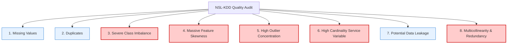

# NSL-KDD Data Quality & Production-Readiness Assessment Report

This report evaluates the **NSL-KDD dataset** for production readiness. It outlines key data quality issues, details why they matter in cybersecurity and machine learning contexts, analyzes their impact on model performance, and provides professional MLOps mitigation strategies.

---

## Technical Audit & Analysis



---

## 1. Missing Values
*   **Audit Finding**: The clean standard files of NSL-KDD (`KDDTrain+.txt`, `KDDTest+.txt`) have **zero missing or null values** across all columns.
*   **Why It Matters**: The dataset has been pre-cleaned. While this is convenient for academic testing, real-world raw packet captures (PCAPs) or server logs always contain missing, dropped, or corrupted telemetry fields.
*   **Impact on ML Models**: Zero impact during offline training. However, in a real-time inference pipeline, models will crash if they encounter a null value unless a robust imputation step is included.
*   **Mitigation Strategy**: Build a defensive ingestion layer. Ensure the feature engineering code contains automated imputers (e.g., using `SimpleImputer` with `strategy='median'` for numerical features and `'most_frequent'` for categorical ones) before serving the model in production.

---

## 2. Duplicate Records
*   **Audit Finding**: The original KDDCUP'99 dataset suffered from severe duplication (about $78\%$ training duplicates and $75\%$ test duplicates). **NSL-KDD resolved this issue** by removing these duplicate records, leaving only unique network connection profiles in both splits.
*   **Why It Matters**: Duplicate samples artificially inflate model performance evaluation. If a model overfits to a common connection type, and that connection appears thousands of times in both training and test sets, the test metrics will look extremely high despite the model being unable to generalize.
*   **Impact on ML Models**: Because NSL-KDD has no duplicates, model evaluation metrics (Precision, Recall, F1) are highly representative of actual classification capabilities.
*   **Mitigation Strategy**: No action is needed for the offline NSL-KDD dataset. However, in live training pipelines, keep a deduplication filter in the feature store to prevent identical packet telemetry records from repeating.

---

## 3. Severe Class Imbalance
*   **Audit Finding**: Extreme data distribution skew. Denial of Service (DoS) and Probing represent over $95\%$ of all anomaly records. Conversely, User-to-Root (U2R) and Remote-to-Local (R2L) are extremely rare.

```text
Class Distribution (KDDTrain+ Baseline Estimation):
├── Normal: ~53.5%
└── Anomalies: ~46.5%
    ├── DoS: ~36.5% (High)
    ├── Probe: ~9.2% (Medium)
    ├── R2L: ~0.75% (Critical Imbalance)
    └── U2R: ~0.04% (Severe Imbalance - ~52 cases)
```

*   **Why It Matters**: In cybersecurity, a single successful U2R intrusion (unauthorized root shell access) can compromise an entire system, while a blocked DoS is simply a resolved resource exhaust attempt. 
*   **Impact on ML Models**: Standard classifiers will optimize for overall global accuracy. A model can achieve $>99.9\%$ accuracy by completely ignoring the U2R class, resulting in a system that is blind to high-severity privilege escalation attempts.
*   **Mitigation Strategy**:
    1.  **Metric Selection**: Never use global accuracy. Optimize models using **Recall** and **F1-Score** per class (or Macro-average F1).
    2.  **Loss Function Adjustment**: Use cost-sensitive learning by applying class weights during model training (e.g., setting `scale_pos_weight` in XGBoost, or using custom focal loss).
    3.  **Resampling**: Apply Synthetic Minority Over-sampling Technique (SMOTE) combined with Edited Nearest Neighbors (SMOTE-ENN) exclusively to the training split.

---

## 4. Massive Feature Skewness
*   **Audit Finding**: Raw numerical packet volumetric features, specifically `src_bytes`, `dst_bytes`, and `duration`, exhibit extreme right-skewness (skewness values $> 20$).
*   **Why It Matters**: Volumetric traffic spans orders of magnitude: a simple ping is 64 bytes, while a database backup can be gigabytes.
*   **Impact on ML Models**: Linear models, Support Vector Machines (SVMs), and Neural Networks will struggle to converge. Outlier byte values will dominate gradient updates, washing out smaller signals in adjacent features. While tree-based models are less affected, skewness still impacts their split decisions.
*   **Mitigation Strategy**: Apply a logarithmic transform: $y = \log(x + 1)$. This reduces range variance, making distributions more normal.

---

## 5. Extreme Outliers
*   **Audit Finding**: Standard network connection counts (`count`, `srv_count`, etc.) contain massive outliers due to bursty, automated flood activity.
*   **Why It Matters**: Bursty traffic is a natural network pattern, not an error. Dropping outliers is not an option, as it would delete the primary signatures of active attacks.
*   **Impact on ML Models**: Standard Z-score normalization scaling:
    $$z = \frac{x - \mu}{\sigma}$$
    uses the mean ($\mu$) and standard deviation ($\sigma$), both of which are highly sensitive to outliers. The presence of outliers compresses normal values into a very tight range around zero, destroying feature resolution.
*   **Mitigation Strategy**: Avoid standard scaling. Instead, use a **Robust Scaler**, which scales features using the median and Interquartile Range (IQR):
    $$x_{\text{robust}} = \frac{x - \text{median}}{\text{IQR}}$$

---

## 6. High Cardinality Categorical Variables
*   **Audit Finding**: The `service` variable has over 70 unique categories (e.g., `http`, `smtp`, `ftp`, `auth`, `private`, `ecr_i`, etc.).
*   **Why It Matters**: Representing 70+ categories can introduce high-dimensionality issues.
*   **Impact on ML Models**: Standard One-Hot Encoding (OHE) will generate 70+ sparse columns. This leads to the "curse of dimensionality," slowing down training, increasing memory footprints, and causing tree-based models to overfit on rare service combinations.
*   **Mitigation Strategy**:
    1.  **Frequency Consolidation**: Group low-frequency services (e.g., services appearing $< 0.1\%$ of the time) into a single `'other_service'` category.
    2.  **Target / Mean Encoding**: Encode the service categories based on the probability of an anomaly occurring on that specific service, with regularization to prevent leakage.

---

## 7. Potential Data Leakage: The `difficulty_score` Column
*   **Audit Finding**: Some raw NSL-KDD distributions include a 43rd column representing a `difficulty_score` calculated by previous research evaluations.
*   **Why It Matters**: This score was derived post-hoc based on how many academic classifiers struggled to classify the record correctly. It contains direct information about the predictability of the record.
*   **Impact on ML Models**: If left in the training data, a model will rely on the `difficulty_score` to determine if a connection is an anomaly. Because this score does not exist in real-world network traffic, the model's performance will drop drastically when deployed.
*   **Mitigation Strategy**: Explicitly drop the `difficulty_score` feature before feeding the data into any preprocessing or training pipelines.

---

## 8. Feature Redundancy (Multicollinearity)
*   **Audit Finding**: Time-based and host-based features share redundant statistical relationships. Specifically, the error rate indicators (`serror_rate`, `srv_serror_rate`, `dst_host_serror_rate`, `dst_host_srv_serror_rate`) correlate at $> 0.95$.
*   **Why It Matters**: Storing and calculating redundant features increases computing overhead without adding new information.
*   **Impact on ML Models**:
    -   **Linear Models**: Multi-collinearity makes coefficient estimates unstable, meaning the model's feature importance indicators will be unreliable.
    -   **Tree Models**: While XGBoost handles multicollinearity well, it still wastes computing resources splitting on equivalent columns, slowing down inference speeds.
*   **Mitigation Strategy**: Analyze correlation matrices and apply Variance Inflation Factor (VIF) checks. If feature redundancy impacts execution speeds, drop redundant intermediate service-level rate columns, keeping only the primary host-level rates.
