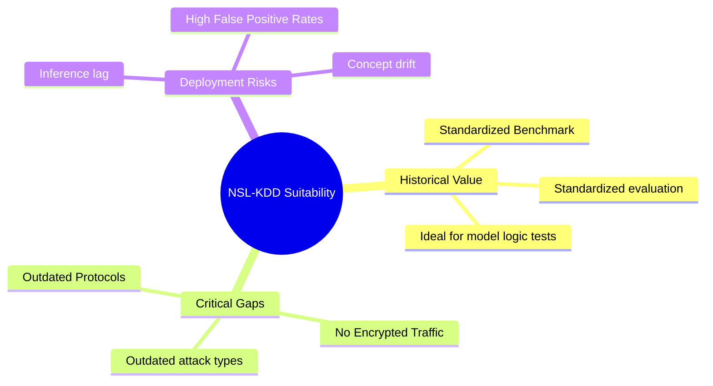
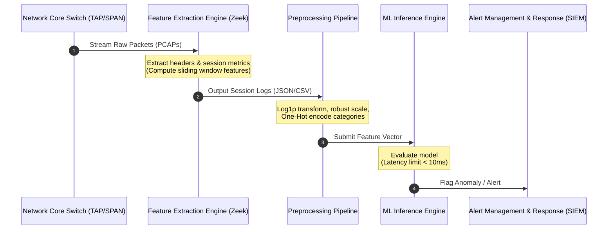
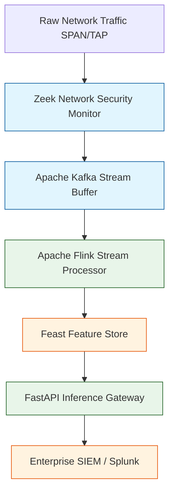

# NSL-KDD Enterprise Critical Assessment & Real-World NIDS Architecture

This report evaluates the **NSL-KDD dataset** for use in an enterprise network security program. It details the gap between legacy academic benchmarks and modern enterprise network environments, outlines operational challenges when deploying machine learning models to live traffic, and proposes a modern architecture for building a realistic, production-ready Network Intrusion Detection System (NIDS).

---

## 1. Enterprise Suitability Assessment

### Gap Analysis: NSL-KDD vs. Modern Enterprise Traffic

The NSL-KDD dataset represents network traffic captured in **1998** (derived from the DARPA 1998 intrusion detection evaluation). The landscape of enterprise networking has changed completely since then:

#### A. The Encryption Blindspot
*   **NSL-KDD Representation**: Almost all connections in NSL-KDD are unencrypted, plain-text sessions (HTTP, FTP, SMTP, Telnet). Features like `hot`, `logged_in`, and `num_failed_logins` assume payload inspection is easy.
*   **Modern Enterprise Reality**: Today, **over $90\%$ of enterprise web traffic is encrypted** (HTTPS, TLS 1.3, SSH, SFTP, IPsec). Deep Packet Inspection (DPI) of payloads is computationally expensive, requires active decryption proxies (TLS break-and-inspect), or is prevented by privacy regulations.
*   **Impact**: Payload-dependent content features in NSL-KDD are not directly applicable to modern encrypted networks without active decryption layers.

#### B. Outdated Protocol Profile
*   **NSL-KDD Representation**: Heavy emphasis on protocols that are now deprecated or restricted in secure enterprises, such as `telnet`, `gopher`, `uucp`, `irc`, `tftp`, and `finger`.
*   **Modern Enterprise Reality**: Modern traffic is dominated by web protocols (HTTP/2, HTTP/3, gRPC), API traffic (REST, JSON over HTTPS), cloud-native serialization (Protobuf, Avro), and enterprise infrastructure protocols (Active Directory, LDAP, Kerberos, SMBv3, DNS over HTTPS - DoH).
*   **Impact**: Models trained on NSL-KDD will overfit to outdated protocol signatures, failing to understand modern traffic profiles.

#### C. Outdated Threat Vectors
*   **NSL-KDD Representation**: Attack definitions reflect early hacking techniques, such as ICMP floods (`smurf`), overlapping fragmentation bugs (`teardrop`), or basic buffer overflows on old local daemons.
*   **Modern Enterprise Reality**: Contemporary threats involve sophisticated, multi-stage attacks:
    *   **Advanced Persistent Threats (APTs)**: Highly stealthy, slow-moving lateral movement.
    *   **Application-Layer DDoS**: Slowloris, API endpoints exhaustion, distributed botnet HTTP floods.
    *   **Encrypted Command & Control (C2)**: Malicious traffic hidden inside legitimate TLS sessions or masquerading as HTTPS cloud traffic (domain fronting).
    *   **Ransomware & Living off the Land (LotL)**: Abusing standard administrative tools (PowerShell, WMI) rather than dropping raw binary exploits.
*   **Impact**: Models trained on NSL-KDD are completely blind to modern application-layer threats and C2 communication techniques.

---

## 2. Technical Biases & Overfitting Risks

Relying solely on NSL-KDD as a benchmark introduces several technical risks:

### A. Overfitting to Static Network Signatures
*   **The Issue**: NSL-KDD includes connection statistics computed within a static, pre-defined 2-second time window (`count`, `srv_count`, etc.) or a fixed 100-connection limit.
*   **The Risk**: Real-world network structures and connection frequencies vary widely based on network size, bandwidth capacity, and peak usage hours. A model that associates an attack with a specific connection count (e.g., `count > 250`) will generate high false-alarm rates during benign peak business hours, or miss slow, stealthy port sweeps designed to stay below those thresholds.

### B. High False Positive Rates (FPR)
*   **The Issue**: A typical enterprise network processes millions of connections per second. Even a low false positive rate of **$0.1\%$** translates to thousands of false alerts per hour, quickly overwhelming security operations center (SOC) analysts.
*   **The Risk**: Models trained on older datasets often have high false-positive rates on modern traffic due to unfamiliar application behaviors, cloud sync processes, and remote work connections. This leads to "alert fatigue," causing analysts to ignore the system or turn off the model.

---

## 3. Real-World Deployment Challenges

Deploying machine learning models for network security introduces distinct operational challenges:

### A. Real-Time Feature Extraction at Scale
*   **The Challenge**: In a production environment, raw packets must be parsed, grouped into connections (using the 5-tuple: Source IP, Source Port, Dest IP, Dest Port, Protocol), and transformed into features in real time.
*   **The Reality**: Computing sliding-window traffic features (such as counts and error rates over the last 2 seconds) for gigabit-speed connections requires high-performance stateful stream processing engines. This demands significant CPU, memory, and hardware resources.

### B. Inference Latency Constraints
*   **The Challenge**: For inline prevention (e.g., an Intrusion Prevention System - IPS that blocks packets), the model's inference latency must be **under 10 milliseconds**.
*   **The Reality**: Complex models (large ensembles, deep neural networks) can add unacceptable delay to network routing. Feature preprocessing and inference must be optimized to prevent network performance degradation.

### C. Concept Drift & Model Maintenance
*   **The Challenge**: Networks are dynamic environments. Adding new software, migrating to cloud platforms, or adopting new devices changes normal traffic baselines.
*   **The Reality**: An intrusion detection model's performance decays quickly if the model is static. Continuous monitoring, retuning, and automated retraining pipelines are required to handle this concept drift.

---

## 4. Architecture Recommendations for Modern NIDS

To transition from legacy benchmark research to a realistic, production-ready enterprise NIDS, we recommend the following system architecture:

### 1. Modern Data Collection (Zeek)
*   Instead of capturing raw PCAP files, use a network monitoring tool like **Zeek (formerly Bro)**. Zeek analyzes packet streams in real time and outputs structured, semantic network logs (e.g., `conn.log`, `http.log`, `ssl.log`, `dns.log`). This provides rich, high-level features directly, without the need for manual packet reassembly.

### 2. Focus on Metadata & TLS Fingerprints (JA3)
*   To handle encrypted traffic, avoid deep packet inspection. Instead, train models on network session metadata and TLS handshake fingerprints:
    *   **JA3 / JA3S**: Fingerprints the TLS client hello and server hello packet structure. This helps identify malicious software agents (malware, C2 beacons) even if the communication payload is encrypted.
    *   **ALPN (Application-Layer Protocol Negotiation)**: Analyzes protocol negotiation details to flag anomalies.

### 3. Implement Hybrid Detection
*   **Rule-Based Detection (Snort / Suricata)**: Use high-speed signature matching to block known threats, vulnerability exploits, and common malware signatures.
*   **Machine Learning (Anomalous Behavior)**: Apply machine learning models to detect unknown threats, zero-day exploits, and slow lateral movement by identifying anomalies compared to established baseline behaviors.

### 4. Build a Robust Stream Processing Pipeline
*   Use standard stream processing tools like **Apache Kafka** and **Apache Flink** to compute sliding window statistics (such as connection rates and error ratios) in real time over incoming network logs.

### 5. Establish a Continuous Training Loop
*   Implement continuous monitoring to flag out-of-distribution traffic inputs, indicating concept drift. Create a feedback loop where security analysts can label false positives, which are then used to retrain and update the model automatically.
