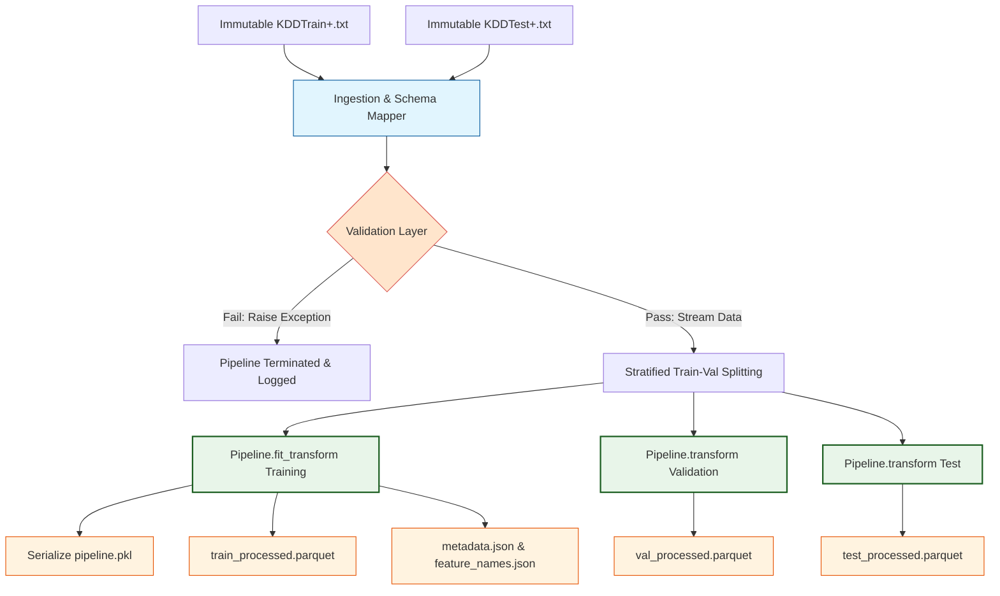

# Preprocessing Pipeline Architectural Design Document: Phase 2

This document establishes the **Production-Grade Preprocessing Pipeline Architecture** for the Network Intrusion Detection and Threat Analytics Platform. It serves as the engineering blueprint for Phase 2, detailing how raw network data is systematically ingested, validated, transformed, versioned, and exported into model-ready artifacts for both training and real-time inference.

---

## 1. Directory Structure

To support a reproducible, testable, and automated pipeline, we organize our feature engineering folder modularly under `src/features/`. 

```text
c:/Users/Swathi/Desktop/Finn/Projects/Network ML/
├── configs/
│   └── data_config.yaml        # Preprocessing parameters & feature classifications
│
├── data/
│   ├── raw/                    # Immutable raw files (KDDTrain+.txt, KDDTest+.txt)
│   └── processed/              # [NEW] Model-ready outputs: Parquet, PKL pipeline, JSON metadata
│
├── src/
│   └── features/
│       ├── __init__.py
│       ├── build_features.py   # Orchestrator & CLI entry point
│       ├── preprocessing.py    # Main pipeline assembler (ColumnTransformer)
│       ├── transformers.py     # Custom Scikit-Learn transformers (Frequency Encoder, Log1p)
│       └── validation.py       # Data validation layer (Schema, Types, Empty checks)
│
├── tests/
│   ├── test_preprocessing.py   # Unit tests for preprocessing steps
│   └── test_validation.py      # Unit tests for the validation layer
│
└── reports/
    ├── preprocessing_architecture.md  # This design document
    └── dataset_decisions.md           # Preprocessing blueprint decisions
```

---

## 2. Pipeline Architecture Diagram

The architecture follows a strict **sequential, validated, and state-preserving pipeline** that ensures complete isolation between training and inference runs, preventing target leakage:



---

## 3. Component Responsibilities

The system is decoupled into five core components, each managing a specific stage in the pipeline:

### 1. Ingestion Layer (`src/data/make_dataset.py`)
- **Responsibility**: Ingest raw, comma-separated values (CSV) from the raw directories.
- **Rules**: Raw files are strictly **read-only/immutable**. Applies standardized headers and drops post-hoc features (`difficulty_score`, `num_outbound_cmds`) immediately upon loading to prevent downstream target leakage.

### 2. Validation Layer (`src/features/validation.py`)
- **Responsibility**: Data contract enforcement. Ensures incoming data conforms to exact architectural rules before allowing pipeline execution.
- **Checks**:
  - Drops execution if the dataset is empty.
  - Verifies presence of all required columns.
  - Detects duplicate connections and logs warnings.
  - Compares column data types against standard schemas.
  - Flags unexpected categorical classes or invalid target labels.
- **Failures**: Any critical schema mismatch raises a descriptive custom exception and terminates execution immediately.

### 3. Custom Transformers (`src/features/transformers.py`)
- **Responsibility**: Houses state-preserving scikit-learn compatible transformer classes.
- **Key Transformers**:
  - **`FrequencyEncoder`**: Tracks categorical frequency distributions during `fit()`, maps high-frequency categories, and automatically groups rare classes into an `'other'` category during `transform()`. Handles unseen categories at inference safely.
  - **`Log1pTransformer`**: Custom element-wise log-transform wrapper for continuous skewed variables.

### 4. Transformation Assembler (`src/features/preprocessing.py`)
- **Responsibility**: Assembles standard scikit-learn preprocessors, scaling pipelines, and categorical encoders into a unified `Pipeline` and `ColumnTransformer` object.
- **State Preservation**: Fits *exclusively* on the training split, and transforms validation and test splits using that pre-fit state.

### 5. Orchestrator CLI (`src/features/build_features.py`)
- **Responsibility**: The primary entry-point script. Resolves command-line calls, instantiates pipelines, coordinates dataset transformations, logs execution statistics, tracks metadata, and writes parquet and JSON files to `data/processed/`.

---

## 4. Artifact Specifications

Phase 2 will automatically generate six reproducible artifacts inside `data/processed/`:

### 1. Parquet Datasets (`train_processed.parquet`, `val_processed.parquet`, `test_processed.parquet`)
- **Format**: Apache Parquet.
- **Why Parquet**: Compact file sizes (columnar storage), preserves rich pandas schema metadata, supports compression (Snappy), and loads significantly faster than raw CSVs.
- **Content**: Numerical-only matrices where categoricals have been expanded, skewed columns log-scaled, and columns sorted deterministically.

### 2. Pipeline Binary (`preprocessing_pipeline.pkl`)
- **Format**: Serialized python binary (`pickle` or `joblib`).
- **Why PKL**: Preserves the complete fitted states of our estimators (e.g., category-to-integer mappings, median and IQR thresholds in `RobustScaler`).
- **Production Role**: Serves as the immutable feature pipeline loaded directly by our inference microservice.

### 3. Feature Mapping Schema (`feature_names.json`)
- **Format**: Structured JSON list of strings.
- **Why JSON**: Standard, human-readable file. Contains the exact names and order of columns in the transformed parquet matrix (essential to ensure the prediction API receives features in the correct order).

### 4. Metadata Logs (`metadata.json`)
- **Format**: Structured JSON dictionary.
- **Standard Schema**:
```json
{
  "dataset_version": "1.0.0",
  "timestamp": "2026-06-01T08:35:00Z",
  "raw_shapes": {
    "train_raw_samples": 125973,
    "test_raw_samples": 22544
  },
  "processed_shapes": {
    "train_processed_samples": 100778,
    "val_processed_samples": 25195,
    "test_processed_samples": 22544,
    "features_before_processing": 41,
    "features_after_processing": 122
  },
  "class_distribution_train": {
    "0 (Benign)": 53643,
    "1 (Anomaly)": 47135
  },
  "pipeline_steps": [
    "DropLeakageAndDeadColumns",
    "DataValidationPassed",
    "FrequencyConsolidateService",
    "OneHotEncodeCategoricals",
    "Log1pSkewedNumerics",
    "RobustScaleCounts",
    "PassthroughRatesAndBinaries"
  ],
  "categorical_mappings": {
    "protocol_type": ["tcp", "udp", "icmp"],
    "service": ["http", "private", "smtp", "domain_u", "other"],
    "flag": ["SF", "S0", "REJ", "RSTR", "other"]
  }
}
```

---

## 5. Error Handling Strategy

To achieve enterprise-grade reliability, the pipeline implements defensive error handling:

1.  **Custom Exception Hierarchy**: We define standard, structured pipeline exception classes:
    -   `PipelineException(Exception)`: Base exception.
    -   `ValidationException(PipelineException)`: Raised during schema mismatch, empty datasets, or missing required features.
    -   `LeakageException(PipelineException)`: Raised if target leakage indicators (like the presence of `class` in inference payloads or leakage columns) are detected during active transformation.
2.  **Strict Mode**: The orchestrator operates in "Fail-Fast" mode. If any exception in the validation layer triggers, execution halts immediately and returns a non-zero exit code (`1`). No corrupt or incomplete files are written to `data/processed/`.
3.  **Graceful Drift Handling**: Categorical encoders are configured with `handle_unknown='ignore'` or map unseen categorical service classes to the `'other'` index automatically during real-time inference, preventing server crashes during production traffic drift.

---

## 6. Logging Strategy

We implement structured log trails to ensure pipeline issues can be diagnosed easily in production:

1.  **Consolidated Logging Handler**: We utilize `src/utils/logger.py` to route logs to both `sys.stdout` and a persistent file (`data/processed/preprocessing.log`) for execution auditing.
2.  **Pipeline Phase Logging**: Each step in the preprocessing pipeline logs its status and execution metrics:
    -   *INFO*: Ingestion milestones, validation successes, matrix shapes, serialization paths, and execution times.
    -   *WARNING*: Duplicate record detections, high cardinality indicators, or non-critical categorical drift.
    -   *ERROR / CRITICAL*: Missing columns, schema mismatch exceptions, empty datasets, or serialization failures.
3.  **Deterministic Feature Counts**: The logging engine prints the exact number of features before and after transformation (e.g., `"Transformed categorical protocols: 3 columns -> expanded to 14 binary columns."`) to provide an instant audit of the transformation steps.
